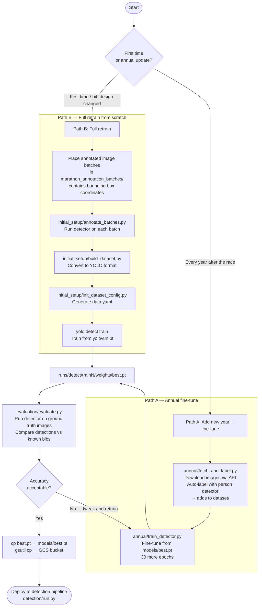

# Training Guide

This directory contains all scripts for training and evaluating the bib detection model.

---

## Design

### What we're trying to do

Given a race photo, automatically read the bib number worn by each runner and record which image they appear in. This is used to let participants find their own photos after a race.

### Why train a model at all?

Off-the-shelf OCR (EasyOCR) can read digits from a clean, cropped image — but it fails on full race photos because the bib is tiny, at an angle, partially obscured, or surrounded by other text (sponsor logos, clothing patterns). We need to first **isolate the runner**, then hand a tight crop to OCR.

### What is actually trained

Only the **person detector** is trained — a YOLOv8n model that draws a bounding box around each runner. OCR is applied inside that box, cropped to the torso (top 55% of the bounding box) where the bib sits. EasyOCR is not trained; it handles printed digits out of the box.

So training means: _teach the model to reliably find runners in marathon photos specifically_.

A generic COCO-trained person detector works but produces too many false positives on spectators, banners, and partial bodies at the edges of frame. Fine-tuning on actual race images from this event significantly reduces noise.

### What data we train on

- **Manually annotated batches** (Path B — done once): ~1,000 images from the 2024 race with hand-drawn bounding boxes around every runner. This produced the initial `models/best.pt`.
- **Auto-labelled images** (Path A — every year): Images from previous race years fetched via the API. The existing detector auto-generates bounding boxes — no manual work needed. These are added to the dataset and used to fine-tune the model to each year's conditions.

### How the training loop works

1. Images are downloaded and labelled with bounding boxes (person class only — YOLO doesn't need to know bib numbers).
2. YOLOv8n is fine-tuned from the current best weights for 30 epochs with early stopping.
3. The resulting weights are evaluated against a known ground truth set of bib numbers to measure accuracy.
4. If accuracy is acceptable, the new weights replace `models/best.pt` and are pushed to GCS for the detection pipeline to use.

---

## Full process overview



---

## When to do what

| Situation                                          | Path                                         |
| -------------------------------------------------- | -------------------------------------------- |
| Every year after the race — add that year's images | [Path A](#path-a--annual-fine-tune)          |
| Bib design changed significantly                   | [Path B](#path-b--full-retrain-from-scratch) |
| Just want to check current accuracy                | [Evaluate only](#evaluating-accuracy)        |

---

## Prerequisites

```bash
# From repo root
python -m venv venv && source venv/bin/activate
pip install -r detection/requirements.txt
```

Fill in `detection/.env` (copy from `.env.example`). All training scripts load credentials from there.

Model weights are not in git — pull from GCS first:

```bash
gsutil cp gs://YOUR_BUCKET/models/best.pt models/best.pt
gsutil cp gs://YOUR_BUCKET/models/yolov8n.pt models/yolov8n.pt
```

---

## Path A — Annual fine-tune

Use this every year after the race. No manual annotation needed — a generic person detector auto-generates the bounding box labels from the API images.

### Step 1 — Auto-label the new year's images

```bash
python training/annual/fetch_and_label.py --years 23
```

What it does:

- Calls `get-albums.php` to discover all albums for that year
- Calls `get-image-list.php` per album to get every image filename
- Downloads each image and runs `yolov8n.pt` to detect persons
- Writes one YOLO `.txt` label file per image into `dataset/`
- Splits 85% train / 15% val — skips images already present
- Takes ~30 min on GCP `e2-standard-4` with 16 workers

### Step 2 — Fine-tune the model

```bash
# Apple Silicon (local)
python training/annual/train_detector.py --device mps --batch 16

# GCP T4 GPU (~1.5 hrs, ~$0.50 Spot)
python training/annual/train_detector.py --device 0 --batch 32
```

| Flag       | Default | Description              |
| ---------- | ------- | ------------------------ |
| `--epochs` | `30`    | Additional epochs        |
| `--device` | `mps`   | `mps`, `0` (CUDA), `cpu` |
| `--batch`  | `16`    | 32 on T4, 16 on MPS      |
| `--imgsz`  | `640`   | Input resolution         |

Training stops early if validation loss doesn't improve for 10 epochs. Checkpoints go to `runs/detect/trainN/weights/`.

### Step 3 — Evaluate

```bash
python evaluation/evaluate.py --workers 16
```

See [Evaluating Accuracy](#evaluating-accuracy) below.

### Step 4 — Promote weights

```bash
cp runs/detect/train24/weights/best.pt models/best.pt
gsutil cp models/best.pt gs://YOUR_BUCKET/models/best.pt
```

---

## Path B — Full retrain from scratch

Use this if the bib design changes or you're setting the project up for the first time with a fresh annotated dataset.

> **Note:** `marathon_raw_data.txt` / `marathon_raw_data_2023.json` are **not** training inputs — they only contain bib numbers, which YOLO doesn't need. Training needs bounding box coordinates, which come from the annotated image batches below.

### Step 1 — Place annotated image batches

Annotated batches must be structured as:

```
marathon_annotation_batches/
    batch_1/
        batch_metadata.json     ← {"images": [{"filename": "x.jpg", ...}, ...]}
        image_1234.jpg
        ...
    batch_2/
        ...
```

### Step 2 — Generate bounding box detections

```bash
python training/initial_setup/annotate_batches.py
```

Runs the current detector over each batch image and writes bounding box coordinates into `batch_metadata.json`. Requires `models/best.pt`.

### Step 3 — Convert to YOLO dataset

```bash
python training/initial_setup/build_dataset.py
```

Reads all batches with detections, converts boxes to YOLO normalised format, writes to:

```
dataset/
    images/train/   ← 80%
    images/val/     ← 20%
    labels/train/
    labels/val/
```

Already-processed batches are skipped (tracked in `processed_batches.json`).

### Step 4 — Generate data.yaml

```bash
python training/initial_setup/init_dataset_config.py
```

Only needed once. Writes `training/data.yaml` pointing to `dataset/`.

### Step 5 — Train

```bash
# GCP T4
yolo detect train data=training/data.yaml model=models/yolov8n.pt \
  epochs=50 imgsz=640 batch=32 device=0

# Apple Silicon
yolo detect train data=training/data.yaml model=models/yolov8n.pt \
  epochs=50 imgsz=640 batch=16 device=mps
```

### Step 6 — Evaluate and promote

Same as Path A steps 3–4.

---

## Evaluating Accuracy

`evaluation/evaluate.py` fetches images from the API, runs the full detection pipeline (YOLO + OCR), and compares the output against known ground truth.

```bash
# Against 2024 ground truth (default)
python evaluation/evaluate.py --workers 16

# Against 2023 ground truth
python evaluation/evaluate.py --ground-truth models/marathon_raw_data_2023.json --workers 16

# Quick sanity check — one album, 200 images
python evaluation/evaluate.py --album finish --limit 200

# GCP — more workers
python evaluation/evaluate.py --workers 32
```

| Flag             | Default                        | Description                              |
| ---------------- | ------------------------------ | ---------------------------------------- |
| `--ground-truth` | `models/marathon_raw_data.txt` | Path to ground truth (`.txt` or `.json`) |
| `--album`        | all                            | Filter to one album by name              |
| `--limit`        | none                           | Max images per album                     |
| `--workers`      | `16`                           | Concurrent threads                       |

### Outputs

| Output                   | Contents                                                      |
| ------------------------ | ------------------------------------------------------------- |
| `evaluation_results.csv` | One row per image — ground truth bibs, detected bibs, verdict |
| `failures/`              | Saved JPEGs for every non-exact-match                         |

### Verdict categories

| Verdict          | Meaning                                  |
| ---------------- | ---------------------------------------- |
| `exact_match`    | Detected bibs exactly match ground truth |
| `true_negative`  | No bib in image, none detected — correct |
| `false_positive` | Detected a bib that doesn't exist        |
| `false_negative` | Missed all bibs                          |
| `partial_match`  | Got some right, missed or added others   |
| `wrong`          | Detected something completely different  |
| `fetch_failed`   | Could not download the image             |

---

## Training on GCP

```bash
gcloud compute instances create bib-trainer \
  --machine-type=n1-standard-4 \
  --accelerator=type=nvidia-tesla-t4,count=1 \
  --provisioning-model=SPOT \
  --maintenance-policy=TERMINATE \
  --zone=europe-north1-a \
  --image-family=common-cu121-debian-11-py310 \
  --image-project=deeplearning-platform-release \
  --scopes=storage-rw

gcloud compute ssh bib-trainer --zone=europe-north1-a
```

On the VM:

```bash
git clone https://github.com/YOUR_USERNAME/bib-detection-service.git && cd bib-detection-service
gsutil cp gs://YOUR_BUCKET/models/best.pt models/best.pt
python -m venv venv && source venv/bin/activate
pip install -r detection/requirements.txt
cp detection/.env.example detection/.env   # fill in your values

# Path A
python training/annual/fetch_and_label.py --years 23
python training/annual/train_detector.py --device 0 --batch 32

# Push new weights back
gsutil cp runs/detect/$(ls -t runs/detect | head -1)/weights/best.pt gs://YOUR_BUCKET/models/best.pt
```

**Delete the VM when done:**

```bash
gcloud compute instances delete bib-trainer --zone=europe-north1-a
```

---

## Script Reference

| Script                                 | Purpose                                         | Typical runtime   |
| -------------------------------------- | ----------------------------------------------- | ----------------- |
| `annual/fetch_and_label.py`            | Download + auto-label older race images via API | ~30 min (GCP e2)  |
| `annual/train_detector.py`             | Fine-tune from `models/best.pt`                 | ~1.5 hrs (GCP T4) |
| `evaluation/evaluate.py`               | Measure accuracy against ground truth           | ~20 min (GCP e2)  |
| `initial_setup/annotate_batches.py`    | Add detections to annotation batch metadata     | minutes per batch |
| `initial_setup/build_dataset.py`       | Convert batches → YOLO dataset                  | ~5 min            |
| `initial_setup/init_dataset_config.py` | Generate `training/data.yaml`                   | seconds           |
